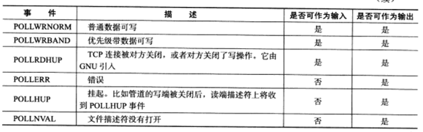

# I/O多路复用技术

* [1. select系统调用](#1)
* [2. poll系统调用](#2)
* [3. epoll系统调用](#3)

* I/O复用使得程序能同时监听多个文件描述符，这对提高程序的性能至关重要。通常，网络程序在下列情况下需要使用I/O复用技术:
    1. 客户端程序要同时处理多个socket。
    2. 客户端程序要同时处理用户输入和网络连接。
    3. TCP服务器要同时处理监听socket和连接socket。这是I/O复用使用最多的场合。
    4. 服务器要同时处理TCP请求和UDP请求。
    5. 服务器要同时监听多个端口，或者处理多种服务。

<h2 id="1">1. select系统调用</h2>

* select系统调用的原型

```
#include<sys/select.h>
int select(int nfds, fd_set* readfds, fd_set* writefds, fd_set* exceptfds, struct timeval* timeout);
```

nfds: 指定被监听的文件描述符的总数。它通常被设置为select监听的所有文件描述符中的最大值加1，因为文件描述符是从0开始计数的。

readfds, writefds和exceptfds参数分别指向可读，可写和异常等事件对应的文件描述符集合。应用程序调用select函数时，通过这3个参数传入自己感兴趣的文件描述符。select调用返回时，内核将修改他们来通知应用程序那些文件描述符已经就绪，这三个参数是fd_set结构体指针类型。

```
#include <typesizes.h>

#define __FD_SETSIZE 1024
#include <sys/select.h>
#define FD_SETSIZE __FD_SETSIZE
typedef long int __fd_mask;
#undef __NFDBITS
#define __NFDBITS ( 8 * (int) sizeof (__fd_mask) )
typedef struct
{
    #ifdef __USE_XOPEN
        __fd_mask fds_bits[ __FD_SETSIZE / __NFDBITS ];
    #define __FDS_BITS(set) ((set)->fds_bits)
    #else
        __fd_mask __fds_bits[ __FD_SETSIZE / __NFDBITS ];
    #define __FDS_BITS(set) ((set)->__fds_bits)
    #endif
} fd_set;
```

由于位操作过于烦琐，我们应该使用下面的一系列宏来访问fd_set结构体中的位：

```
#include <sys/select.h>
FD_ZERO(fd_set *fdset); /*清除fdset的所有位*/
FD_SET(int fd, fd_set *fdset);  /*设置fdset的位fd*/
FD_CLR(int fd, fd_set *fdset);  /*清除fdset的位fd*/
int FD_ISSET(int fd, fd_set *fdset);    /*测试fdset的位fd是否被设置*/
```

timeout：用来设置select函数的超时时间。它是一个timeval结构类型的指针，采用指针参数是因为内核将修改它以告诉应用程序select等待了多久。不过我们不能完全信任select调用返回后的timeout值，比如调用失败时timeout值是不确定的。

```
struct timeval
{
    long tv_sec;    /*秒数*/
    long tv_usec;   /*微妙数*/
};
```

如果timeout变量的tv_sec和tv_usec成员都传递0，则select将立即返回。如果给timeout传递NULL，则select将一直阻塞，直到某个文件描述符就绪。
select成功时返回就绪(可读，可写和异常)文件描述符的总数。如果在超时时间内没有任何文件描述符就绪，select将返回0.select失败时返回-1并设置errno。如果在select等待期间，程序接收到信号，则select立即返回-1，并设置errno为EINTR。

* 文件描述符就绪条件

    1. socket内核接收缓存区中的字节数大于或等于其低水位标记SO_RCVLOWAT.此时我们可以无阻塞地读该socket，并且读操作返回的字节数大于0.
    2. socket通信的对方关闭连接。此时对该socket的读操作将返回0.
    4. 监听socket上有新的连接请求。
    5. socket上有未处理的错误。此时我们可以使用getsockopt来读取和清除该错误。
    6. socket内核发送缓存区中的可用字节数大于或等于其低水位标记SO_SNDLOWAT.此时我们可以无阻塞的写该socket，并且写操作返回的字节数大于0.
    7. socket的写操作被关闭。对写操作被关闭的socket执行写操作将触发一个SIGPIPE信号。
    8. socket使用非阻塞connect连接成功或者失败(超时)之后。
    9. socket上有未处理的错误。此时我们可以使用getsockopt来读取和清除该错误。


<h2 id="2">2. poll系统调用</h2>

* poll系统调用

poll系统调用和select类似，也是在指定时间内轮询一定数量的文件描述符，以测试其中是否有就绪者。

```
#include <poll.h>
int poll(struct pollfd* fds, nfds_t nfds, int timeout);
```

fds: 是一个pollfd结构类型的数组，它指定所有我们感兴趣的文件描述符上发生的可读，可写和异常等事件。

```
struct pollfd
{
    int fd; /*文件描述符*/
    short events;   /*注册的事件*/
    short revents;  /*实际发生的事件，由内核填充*/
};
```


