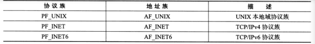
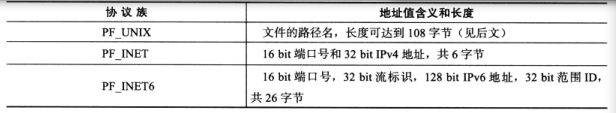
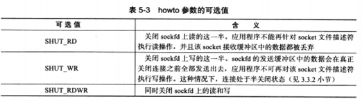
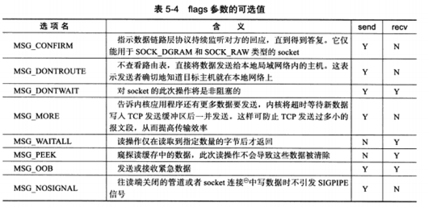
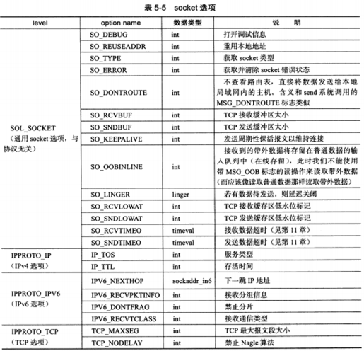

# C/C++ socket API

* [1.主机字节序和网络字节序](#1)
* [2.Linux socket地址 结构体](#2)
* [3.Linux ip地址转换函数](#3)
* [4.Linux socket API](#4)

<h2 id="1">1. 主机字节序和网络字节序</h2>
* Linux 提供4个函数来完成主机字节序和网络字节序之间的转换(#include<netinet/in.h>)

1. unsigned long int htonl(unsigned long int hostlong); //主机转网络字节序  ,转4字节 ,小端转大端
2. unsigned short int htons(unsigned short int hostshort); //主机转网络字节序  转2字节,端口大转小
3. unsigned long int ntohl(unsigned long int netlong);  //网络转主机字节序  转4字节，大端转小端
4. unsigned short int ntohs(unsigned short int netshort);   //网络转主机字节序  转2字节,端口大转小
长整型一般用来转换IP地址，短整型一般用来转换端口号。

<h2 id="2">2. Linux socket地址 结构体</h2>



* 通用网络结构体

```
//旧的
struct sockaddr
{
    sa_family_t sa_family;
    char sa_data[14];
}
```
sa_family : 地址族类型(sa_family_t)变量。
sa_data成员用于存放socket地址值。不同的协议族的地址值具有不同的含义和长度。



```
//新的
struct sockaddr_storage
{
    sa_family_t sa_family;
    unsigned long int __ss_align;
    char __ss_padding[128-sizeof(__ss_align)];
}
```
__ss_align成员是内存对齐的。


* 专用socket
UNIX本地域协议族使用如下专用socket地址结构体(#include<sys/un.h>)：

```
struct sockaddr_un
{
    sa_family_t sin_family; /*地址族：AF_UNIX*/
    char sun_path[108]; /*文件路径名*/
};
```

TCP/IP协议族有sockaddr_in 和 sockaddr_in6 两个专用socket地址结构体，他们分别用于IPv4 和 IPv6：
```
//IPv4
struct sockaddr_in
{
    sa_family_t sin_family; /*地址族：AF_INET*/
    u_int16_t sin_port; /*端口号，要用网络字节序表示*/
    struct in_addr sinaddr; /*IPv4 地址结构，*/
}
struct in_addr
{
    u_int32_t s_addr; /*IPv4地址， 要用网络字节序表示*/
};

struct sockaddr_in6
{
    sa_family_t sin6_family;    /*地址族: AF_INET6*/
    u_int16_t sin6_port;    /*端口好，要用网络字节序表示*/
    u_int32_t sin6_flowinfo; /*流信息， 应设置为0*/
    struct in6_addr sin6_addr; /*IPv6地址结构体*/
    u_int32_t sin6_scope_id; /*scope ID, 目前处于实验阶段*/
};

struct in6_addr
{
    unsigned char sa_addr[16]; /*IPv6地址， 要用网络字节序表示*/
};
```

所有专用的socket地址(以及sockaddr_storage)类型的变量在实际使用时都需要转化为通用socket地址类型sockaddr。

<h2 id="3">3. Linux ip地址转换函数</h2>

* 下面3个函数可用于点分十进制字符串表示的IPv4地址和用网络字节序整数表示的IPv4地址间转换(#include<arpa/inet.h>):
1. in_addr_t inet_addr(const char* strptr);
inet_addr： 将点分十进制字符串表示的IPv4地址转化为网络字节序整数表示IPv4地址，它失败时返回INADDR_NONE
2. int inet_aton(const char* cp, struct in_addr* inp);
inet_aton: 和inet_addr功能一样，但是将转化结果存储于参数inp指向的地址结构中，成功返回1，失败返回0
3. char* inet_ntoa(struct in_addr in);
inet_ntoa将用网络字节序整数表示的IPv4地址转化为用点分十进制字符串表示的IPv4地址。（它是一个不可重入函数）

* 下面的函数也能完成和前面3个函数同样的功能，并且它们同时适用于IPv4地址和IPv6地址（#include<arpa/inet.h>）：
1. int inet_pton(int af, const char* src, void* dst);
将用字符串表示的IP地址src(用点分十进制字符串表示的IPv4地址或用十六进制字符串表示的IPv6地址)转成用网络字节序整数表示的IP地址，并把转换结果存储于dst指向的内存中。
af表示地址族。
2. const char* inet_ntop(int af, const void* src, char* dst, sockeln_t cnt);
进行相反的转换，前三个参数的含义与inet_pton的参数相同，最后一个参数cnt指定目标存储单元的大小。下面的两个宏能帮助我们指定这个大小（分别用于IPv4和IPv6）
```
#include <netinet/in.h>
#define INET_ADDRSTREN 16
#define INET6_ADDRSTREN 46
```

<h2 id="4">4.Linux socket API</h2>

UNIX/Linux的一个哲学：所有东西都是文件。socket也不例外，它就是可读，可写，可控制，可关闭的文件描述符。

```
#include<unistd.h>
#include<sys/types.h>
#include<sys/socket.h>
```

* 创建套接字

1. int socket(int domain, int type, int protocol);

domain参数:告诉系统使用哪个底层协议族。 IPv4（PE_INET）, IPv6(PE_INET6), UNIX本地域协议(PE_UNIX)
type: 指定服务类型。服务类型主要有SOCK_STREAM(流服务)，SOCK_UGRAM(数服务)，SOCK_DGRAM(报服务) 还可与上 SOCK_NONBLOCK(非阻塞)， SOCK_CLOEXEC(用fork调用创建子进程时在子进程中关闭该socket)。也可用fcntl来设置
protocol： 在前两个参数构成的协议集合下，再选择一个具体的协议。不过这个值通常都是唯一的。默认设置为0

* 绑定套接字

1. int bind(int sockfd, const struct sockaddr* my_addr, socklen_t addrlen);

将my_addr所指的socket地址分配给未命名的sockfd文件描述符，addrlen参数指该socket地址长度。
成功返回0
失败返回-1并设置errno

* 监听socket

1. int listen(int sockfd, int backlog);

sockfd 指定被监听的socket
backlog ：内核监听队列的最大长度，监听队列的长度如果超过backlog，服务器将不受理新的客户连接。
backlog参数是指所有处于半连接状态(SYN_RCVD)和完全连接状态(ESTABLISHED)的socket上限，处于半连接状态的socket的上限则由/proc/sys/net/ipv4/tcp_max_syn_backlog内核参数定义。

* 接受连接

1. int accept(int sockfd, struct sockaddr *addr, socklen_t *addrlen);

    1. sockfd 指定接受连接的socket。

    2. addr 参数用来获取被接受连接的远端socket地址。该socket地址的长度有addrlen参数指出。accept成功时返回一个新的连接socket，该socket唯一标识了接受的这个连接，服务器可以通过读写该socket来与被接受连接对应的客户端通信。accept失败时返回-1并设置errno。


* 发起连接

1. int connect(int sockfd, const struct sockaddr *serv_addr, socklen_t addrlen);

sockfd socket创建的套接字参数。
serv_addr 是服务器监听的socket地址
addrlen serv_addr地址的长度

* 关闭连接

1. int close(int fd);
2. int shutdown(int sockfd, int howto);

sockfd 是待关闭的socket。
howto参数决定了shutdown的行为。


* 数据读写

对于文件的读写操作read和write同样适用于socket。但是socket编程接口提供了几个专门用于socket数据读写的系统调用，它们增加了对数据读写的控制：

1. ssize_t recv(int sockfd, void *buf, size_t len, int flags);

recv : 读取sockfd数据。
buf和len参数分别指定读缓冲区的位置和大小。
flags 通常设置为0/
recv成功时返回实际读取到的数据长度， recv出错时返回-1并设置errno

2. ssize_t send(int sockfd, const void *buf, size_t len, int flags);

send ： 往sockfd上写入数据。
buf和len参数分别指定写缓冲区的位置和大小。
send成功时返回实际读取到的数据长度， send出错时返回-1并设置errno

* UDP数据读写

1. ssize_t recvfrom(int sockfd, void* buf, size_t len, int flags, struct sockaddr* src_addr, socklen_t* addrlen);

2. ssize_t sendto(int sockfd, const void* buf, size_t len, int flags, const struct sockaddr* dest_addr, socklen_t addrlen);

recvfrom于sendto 往sockfd读取和写入数据。
src_addr : 发送端地址。
dest_addr : 接收端地址。
addrlen ： 地址长度。

把后面两个参数设为NULL，也可用于TCP通信。


* 通用数据读写

1. ssize_t recvmsg(int sockfd, struct msghdr* msg, int flags);
2. ssize_t sendmsg(int sockfd, struct msghdr* msg, int flags);

sockfd : 指定被操作的目标socket。

3. msghdr结构体

```
struct msghdr
{
    void* msg_name;  /*socket 地址*/
    socklen_t msg_namelen; /*socket地址的长度*/
    struct lovec* msg_lov; /*分散的内存块*/
    int msg_iovlen; /*分散的内存块数量*/
    void* msg_control; /*指向辅助数据的起始位置*/
    socklen_t msg_controllen;   /*辅助数据的大小*/
    int msg_flags; /*复制函数中的flags参数，并在调用过程中更新*/
};
//msg_name 成员指向一个socket地址结构体变量，它指定通信对方socket地址。对于面向连接的TCP，必须设置为NULL
struct lovec
{
    void *lov_base; /*内存起始地址*/
    size_t lov_len; /*这块内存的长度*/
};
```




* 带外数据

1. int sockatmark(int sockfd);

此时可以利用带MSG_OOB标志的recv调用来接收带外数据。

* 地址信息函数

1. int getsockname(int sockfd, struct sockaddr* address, socklen_t* address_len);

getsockname : 获取对应本端的地址信息

2. int getpeername(int sockfd, struct sockaddr* address, socklen_t* address_len);

getpeername : 获取对应远端地址信息

* socket选择 文件描述符属性

1. int getsockopt(int sockfd, int level, int option_name, void* option_value, socklen_t* restrict option_len);

2. int setsockopt(int sockfd, int level, int option_name, const void* option_value, socklen_t option_len);

sockfd : 指定被操作的目标socket，level参数指定要操作那个协议的选项


