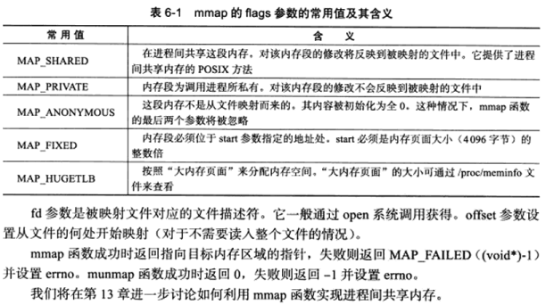
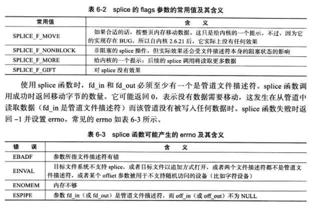

# 高级I/O函数

* 用于创建文件描述符的函数，包括pipe，dup/dup2函数。

```
#include <unistd.h>
int pipe(int fd[2]);
```

pipe: 创建一个管道，可以实现进程间通信。创建了两个文件描述符fd -> fd[0]，fd[1]分别构成管道的两端。 fd[1] 为写端， fd[0]为读端。 默认情况下这一对文件描述符都是阻塞的。Linux2.6.11内核起，管道容量的大小默认为65536字节，可以使用fcntl函数来修改管道容量。 

```
#include <sys/types.h>
#include <sys/socket.h>
int socketpair(int domain, int type, int protocol, int fd[2]);
```

socketpair: 创建双向管道，前三个参数与socket一样

domain: 只能使用UNIX本地域协议族AF_UNIX。

```
#include <unistd.h>
int dup(int file_descriptor);
int dup2(int file_descriptor_one, int file_descriptor_two);
```

dup: 重定向，创建一个新的描述符，该新文件描述符和原有文件描述符file_descriptor指向相同的文件，管道或者网络连接。并且dup返回的文件描述符总是取系统当前可用的最小整数值。dup2和dup类似，不过它将返回第一个不小于file_descriptor的整数值。

* 用于读写数据的函数，包括readv/writev，sendfile，mmap/munmap，splice和tee函数。

```
#include <sys/uio.h>
ssize_t readv(int fd, const struct iovec* vector, int count);
ssize_t writev(int fd, const struct iovec* vector, int count);

struct lovec
{
    void *lov_base; /*内存起始地址*/
    size_t lov_len; /*这块内存的长度*/
};
```

count: vector数组长度

readv: 将数据从文件描述符读到分散的内存块中。

writev: 将多块分散的内存数据一并写入文件描述符中。

```
#include <sys/sendfile.h>
ssize_t sendfile(int out_fd, int in_fd, off_t* offset, size_t count);

```

sendfile: 在两个文件描述符之间直接传递数据(完全在内核中操作)。

in_fd: 待读出内容的文件描述符。

out_fd：待写入内容的文件描述符。

offset：从读入文件流的那个位置开始读，如果为空，则使用读入文件流默认的起始位置。

count: 指定在文件描述符in_fd和out_fd之间传递的字节数。

in_fd必须是一个支持类似mmap函数的文件描述符，即它必须指向真实的文件，不能是socket和管道。而out_fd则必须是一个socket。

```
#include<sys/mman.h>
void* mmap(void* start, size_t length, int prot, int flags, int fd, off_t offset);
int munmap(void* start, size_t length);
```

mmap: 用于申请一段内存空间。我们可以将这段内存作为进程间通信的共享内存，也可以将文件直接映射到其中。

munmap：则释放由mmap创建的这段内存空间。

start: 允许用户使用某个特定的地址作为这段内存的起始地址。NULL则系统自动分配一个地址。

length：指定内存段的长度。

prot：设置内存段的访问权限

PROT_READ:  内存段可读 
PROT_WRITE: 内存段可写
PROT_EXEC:  内存段可执行
PROT_NONE:  内存段不能访问

flags: 控制内存段内容被修改后程序的行为。



```
#include<fcntl.h>
ssize_t splice(int fd_in, loff_t* off_in, int fd_out, loff_t* off_out, size_t len, nusigned int flags);
```

fd_in: 待输入数据的文件描述符。如果fd_in是一个管道文件描述符，off_in必须设置为NULL。如果fd_in不是一个管道文件描述符（比如socket）。那么off_in表示从输入数据流的何处开始读取数据。此时，若off_in设置为NULL，则表示从输入数据流的当前偏移位置读入，若off_in不为NULL，则它将指出具体的偏移位置。fd_out/off_out参数含义与fd_in/off_in相同，用于输出流数据。

len: 指定移动数据的长度。

flags: 则控制数据如何移动。



```
#include <fcntl.h>
ssize_t tee(int fd_in, int fd_out, size_t len, unsigned int flags);
```


* 用于控制I/O行为和属性，包括fcntl函数
