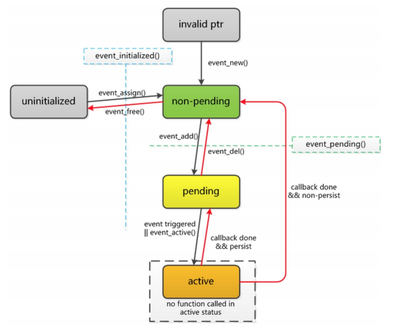

* Libevent 学习

1. 安装方法

```
//在libevent源码目录下执行以下操作

./configure /path //检测安装环境

make

sudo make install
```

2. API说明

    * event_base结构体

        使用libevent函数之前需要分配一个或者多个event_base结构体。每个event_base结构体持有一个事件集合，可以检测以确定那个事件是激活的。

        如果设置event_base使用锁，则可以安全地在多个线程中访问它。然而，其事件循环只能运行在一个线程中。如果需要多个线程检测IO，则需要为每个线程
        使用一个event_base.

        每个event_base都有一种用于检测那种事件已经就绪的"方法"，或者说后端。可以识别的方法有:

        * select
        * poll
        * epoll
        * kqueue
        * devpoll
        * evport
        * win32

    * 创建默认的event_base

        event_base_new()函数分配并且返回一个新的具有默认设置的event_base。函数会检测环境变量，返回一个到event_base的指针。如果发生错误，则返回NULL。选择各种方法时，函数会选择OS支持的最快方法。

        ```
        /*大多数程序使用它就够了*/
        struct event_base *event_base_new(void); /*libevent 1.4.3版后就出现*/
        ```

    * 创建复杂的event_base

        要取得什么类型的event_base有更多的控制，就需要使用event_config.

        event_config是一个容纳event_base配置信息的不透明结构体。需要event_base时，将event_config传递给event_base_with_config().

        ```
        struct event_config *event_config_new(void);
        struct event_base *event_base_with_config(const struct event_config *cfg);
        void event_config_free(struct event_config *cfg);
        ```

        要使用这些函数分配event_base.先调用event_config_new()分配一个event_config.然后，对event_config调用其它函数，设置所需的event_base特征。最后调用event_base_new_with_config()获取新的event_base.完成工作后，使用event_config_free()释放event_config.

        ```
        int event_config_avoid_method(struct event_config *cfg, const char *method);

        enum event_method_feature {
            EV_FETURE_ET = 0x01,
            EV_FETURE_O1 = 0x02,
            EV_FEATURE_FDS = 0x04
        };

        int event_config_require_features(struct event_config *cfg, enum event_method_feature feature);

        enum event_base_config_flag {
            EVENT_BASE_FLAG_NOLOCK = 0x01,
            EVENT_BASE_FLAG_IGNORE_ENV = 0x02,
            EVENT_BASE_STARTUP_IOCP = 0x04,
            EVENT_BASE_FLAG_NO_CACHE_TIME = 0x08,
            EVENT_BASE_FLAG_EPOLL_USE_CHANGELIST = 0x10,
            EVENT_BASE_FLAG_PRECISE_TIMER = 0x20
        };

        int event_config_set_flag(struct event_config *cfg, enum event_base_config_flag flag);
        ```

        调用event_config_avoid_method()可以通过名字让libevent避免使用特定的可用后端。调用event_config_require_feature()让libevent不使用不能提供所有指定特征的后端。调用event_config_set_flag()让libevent在创建event_base时设置一个或者多个运行时标志。

        * event_config_require_features()可识别的特征值有:
            * EV_FEATURE_ET: 要求支持边缘触发的后端
            * EV_FEATURE_O1: 要求添加，删除单个事件，或者确定那个事件激活的操作时0(1)复杂度的后端
            * EV_FEATURE_FDS: 要求支持任意文件描述符，而不仅仅是套接字的后端

        * event_config_set_flag()可识别的选项值有:
            * EVENT_BASE_FLAG_NOLOCK: 不要为event_base分配锁。设置这个选项可以为event_base节省一点用于锁定和解锁的时间，但是让在多个线程中访问event_base成为不安全的。
            * EVENT_BASE_FLAG_IGNORE_ENV: 选择使用的后端时，不要检测EVENT* 环境变量。使用这个标志需要三思:这会让用户更难调试你的程序与libevent的交互。
            * EVENT_BASE_FLAG_STARTUP_IOCP: 仅用于Windows,让libevent在启动时就启用任何必须的IOCP分发逻辑，而不是按需启用。
            * EVENT_BASE_FLAG_NO_CACHE_TIME: 不是在事件循环每次准备执行超时回调时检测当前时间，而是在每次超时回调后进行检测。注意:这会消耗更多的CPU时间。
            * EVENT_BASE_FLAG_EPOLL_USE_CHANGELIST: 告诉libevent,如果决定使用epoll后端，可以安全的使用更更快的基于changelist的后端。epoll-changelist后端可以在后端的分发函数调用之间，同样的fd多次修改其状态的情况下，避免不必要的系统调用。但是如果传递任何使用dup()或者其变体克隆的fd给libevent, epoll-changelist后端会触发一个内核bug，导致不确定的结果。在不使用epoll后端的情况下，这个标志是没有效果的。也可以通过设置 EVENNT_EPOLL_USE_CHANGELIST环境变量来打开epoll-changelist选项。

        上述操作event_config的函数都在成功时返回0，失败时返回-1.

        注意: 设置event_config.请求OS不能提供的后端是很容易的。比如说，对于libevent2.0.1-alpha,在Windows中是没有0(1)后端的；在Linux中也没有同时提供EV_FEATURE_FDS 和 EV_FEATURE_O1特征的后端。如果创建了libevent不能满足的配置，event_base_new_with_config()会返回NULL。


    * 检查event_base后端

        有时候需要检查event_base 支持哪些特性，或者当前使用哪种方法。

        * 接口 1

            ```
            const char **event_get_supported_methods(void);
            ```

            * event_get_supported_methods()函数返回一个指针，指向libevent支持的方法名字数组。这个数组的最后一个元素是NULL。

            实例:

            ```
            int i;
            const char **methods = evnet_get_supported_methods();
            printf("Starting Libevent %s. Available methods are:\n", event_get_version());
            for(i = 0; methods[i] != NULL; ++i)
            {
                printf("    %s\n", methods[i]);
            }
            ```

            这个函数返回libevent被编译以支持的方法列表。然而libevent运行的时候，操作系统可能不能支持所有方法。可能OSX版本中的kqueue的bug大多，无法使用。

        * 接口 2

            ```
            const char* event_base_get_method(const struct event_base *base);

            enum event_method_feature {
                EV_FETURE_ET = 0x01,
                EV_FETURE_O1 = 0x02,
                EV_FEATURE_FDS = 0x04
            };
            event_base_get_features(const struct event_base *base);
            ```

            event_base_get_method()返回event_base正在使用的方法。

            event_base_get_features() 返回event_base支持的特征的比特掩码。

        
        实例:

        ```
        struct event_base *base;
        enum event_method_feature f;

        base = event_base_new();
        if(!base)
        {
            puts("Couldn't get an event_base!");
        }
        else
        {
            printf("Using Libevent with backend method %s.", event_base_get_method(base) );
            f = event_base_get_features(base);
            if((f & EV_FEATURE_ET))
            {
                printf("    Edge-triggered events are supported.");
            }
            if((f & EV_FEATURE_O1))
            {
                printf("    0(1) event notification is supported.");
            }
            if((f & EV_FEATURE_FDS))
            {
                printf("    All FD types are supported");
            }
            puts("");
        }
        ```
        
    * 释放event_base

        ```
        void event_base_free(struct event_base *base);
        ```

    * event_base优先级

        libevent支持为事件设置多个优先级。然而，event_base默认只支持单个优先级。可以调用event_base_priority_init()设置event_base的优先级数目。

        ```
        int event_base_priority_init(struct event_base *base, int n_priorities);
        ```

        成功时这个函数返回0，失败时返回-1.base是要修改的event_base, n_priorities是要支持的优先级数目，这个数目至少是1.每个新的事件可用的优先级将从0(最高)到n_priorities-1(最低).

        常量EVENT_MAX_PRIORITIES表示n_priorities的上限。调用这个函数时为n_priorities给出更大的值是错误的。

        注意:必须在任何事件激活之前调用这个函数，最好在创建event_base后立即调用。


    * event_base和fork

        不是所有事件后端都在调用fork()之后可以正确工作。所以，如果使用fork()或者其他相关系统调用启动新进程之后，希望在新进程中继续使用event_base,就需要进行重新初始化。

        ```
        int event_reinit(struct event_base *base);
        ```

        实例:

        ```
        struct event_base *base = event_base_new();

        if(fork())
        {
            continue_running_parent(base);
        }
        else
        {
            event_reinit(base);
            continue_running_child(base);
        }
        ```


    * 事件循环event_loop

        * 运行循环

            一旦有了一个已经注册了某些事件的event_base(关于如何创建和注册事件请看下一节)， 就需要让libevent等待事件并且通知事件的发生。

            ```
            #define EVLOOP_ONCE     0x01
            #define EVLOOP_NONBLOCK     0x02
            #define EVLOOP_NO_EXIT_ON_EMPTY     0x04

            int event_base_loop(struct event_base *base, int flags);
            ```

        默认情况下,event_base_loop()函数运行event_base直到其中没有已经注册的事件为止。执行循环的时候，函数重复地检查是否有任何已经注册的事件被触发(比如说，读事件的文件描述符已经就绪，可以读取了;或者超时事件的超时时间即将到达)。如果有事件被触发，函数标记被触发的事件为"激活的"，并且执行这些事件。

        在flags参数中设置一个或者多个标志就可以改变event_base_loop()的行为。如果设置了EVLOOP_ONCE, 循环将等待某些事件成为激活的，执行激活的事件直到没有更多的事件可以执行，然会返回。如果设置了EVLOOP_NONBLOCK,循环不会等待事件被触发:循环将仅仅检测是否有事件已经就绪，可以立即触发，如果有，则执行事件的回调。

        完成工作后，如果正常退出，event_base_loop()返回0;如果因为后端中的某些未处理错误而退出，则返回-1.

        实例(理解event_base_loop()算法概要):

            ```
            while(any events are registered with the loop, or EVLOOP_NO_EXIT_ON_EMPTY was set)
            {
                if(EVLOOP_NONBLOCK was set, or any events are already active)
                {
                    If any registered events have triggered, mark them active.
                }
                else
                {
                    Wait until at least one event has triggered, and mark it active.
                }

                for(p = 0; p < n_priorities; ++p)
                {
                    if(any event with priority of p is active)
                    {
                        Run all active events with priority of p.
                        break;
                    }
                }

                if(EVLOOP_ONCE was set or EVLOOP_NONLOCK was set)
                {
                    break;
                }
            }
            ```

            为了方便也可以调用

            ```
            int event_base_dispatch(struct event_base *base);
            ```

            event_base_dispatch() 等同于没有设置标志的event_base_loop(). 
            
            所以，event_base_dispatch() 将一直运行，直到没有已经注册的事件了，或者调用了

            event_base_loopbreak() 或者 event_base_loopexit() 为止。

    
    * 停止循环

        如果想在移除所有已经注册的事件之前停止活动的事件循环，可以调用两个稍有不同的函数。

        ```
        int event_base_loopexit(struct event_base *base, const struct timeval *tv);

        int event_base_loopbreak(struct event_base *base);
        ```

        event_base_loopexit() 让event_base在给定时间之后停止循环。如果tv参数为NULL,event_base会立即停止循环，没有延时。

        如果event_base 当前正在执行任何激活事件的回调，则回调会继续运行，直到运行完所有激活事件的回调后才退出。

        event_base_loopbreak()让event_base立即退出循环。它与event_base_loopexit(base, NULL)的不同在于，如果event_base当前正在执行激活事件的回调，它将在执行完当前正在处理的事件后立即退出。

        注意: event_base_loopexit(base, NULL); 和 event_base_loopbreak(base)在事件循环没有运行时的行为不同；前者安排下一次事件循环在下一轮回调完成后立即停止(就好像带EVLOOP_ONCE标志调用一样);后者却仅仅停止当前正在运行的循环，如果事件循环没有运行，则没有任何效果。

        实例 1:

            ```
            #include <event2/event.h>

            /*这里有一个回调函数调用loopbreak*/
            void cb(int sock, short what, void *arg)
            {
                struct event_base *base = arg;
                event_base_loopbreak(base);
            }

            void main_loop(struct event_base *base, evutil_socket_t watchdog_fd)
            {
                struct event *watchdog_event;

                /*onstruct一个新事件，每当有任何字节要从看门狗套接字读取时，
                该事件就会被触发。当这种情况发生时，我们将调用cb函数，它将
                使循环立即退出，而不运行任何其他活动事件。*/
                watchdog_event = event_new(base, watchdog_fd, EV_READ, cb, base);

                event_add(watchdog_event, NULL);

                event_base_dispatch(base);
            }
            ```

        实例 2(执行事件循环10秒，然后退出):


            ```
            #include <event2/event.h>

            void run_base_with_ticks(struct event_base *base)
            {
                struct timeval ten_sec;
                ten_sec.tv_sec = 10;
                ten_sec.tv_usec = 0;

                /* 现在，我们以10秒为间隔运行event_base，在每个间隔之后打印“Tick”。
                要了解实现10秒计时器的更好方法，请参阅下面关于持久计时器事件的部分。*/

                while(1)
                {
                    /*初始化10秒后退出时间*/
                    event_base_loopexit(base, &ten_sec);

                    event_base_dispatch(base);

                    puts("Tick");
                }
            }
            ```


        有时候需要知道对 event_base_dispatch() 或者 event_base_loop() 的调用是正常退出的，还是因为调用 event_base_loopexit() 或者 event_base_break() 而退出的。 可以调用下述函数来确定是否调用了loopexit或者break函数。


            ```
            int event_base_got_exit(struct event_base *base);

            int event_base_got_break(struct event_base *base);
            ```


        这两个函数分别会在循环是因为调用 event_base_loopexit() 或者 event_base_break() 而退出的时候返回true，否则返回false。下次启动事件循环的时候，这些值会被重设。

    
    * 转储 event_base 的状态

        为帮助调试程序(或者调试libevent),有时候可能需要加入到event_base 的事件及其状态的完整列表。调用event_base_dump_events()可以将这个列表输出到指定的文件中。

            ```
            void event_base_dump_events(struct event_base *base, FILE *f);
            ```

        这个列表是人可读的，未来版本的libevent将会改变其格式。

    * 事件 event

        libevent 的基本操作单元是事件。每个事件代表一组条件的集合，这些条件包括:

            * 文件描述符已经就绪，可以读取或者写入
            
            * 文件描述符变为就绪状态，可以读取或者写入(仅对于边沿触发IO) 

            * 超时事件

            * 用户触发事件 

        所有事件具有相似的生命周期。调用libevent函数设置事件并且关联到 event_base之后，事件进入"已初始化(initialized)状态"。此时可以将事件添加到event_base中，这使之进入"未决(pending)"状态。在未决状态下，如果触发事件的条件发生(比如说，文件描述符的状态改变，或者超时时间到达)，则事件进入"激活(active)"状态，(用户提供的)事件回调函数将被执行。如果配置为"持久的(persistent)",事件将保持为未决状态。否则，执行完回调后，事件不再是未决的。删除操作可以让未决事件成为非未决(已初始化)的；添加操作可以让非未决事件再次成为未决的。


    * 生成新事件

        使用 event_new() 接口创建事件。

        ```
        #define EV_TIMEOUT  0x01    //超时事件
        #define EV_READ     0x02    //读事件
        #define EV_WRITE    0x04    //写事件
        #define EV_SIGNAL   0x08    //信号事件
        #define EV_PERSIST  0x10    //周期性触发
        #define EV_ET       0x20    //边缘触发，如果底层模型支持

        typedef void (*event_cakkback_fn)(evutil_socket_t, short, void*);

        struct event* event_new(struct event_base *base, evutil_socket_t fd, 
                            short what, event_callback_fn cb,
                            void *arg);

        void event_free(struct event *event);
        ```

        event_new() 试图分配和构造一个用于base的新的事件。what参数是上述标志的集合。

        如果fd非负，则它是将被观察其读写事件的文件。

        事件被激活时，libevent将调用cb函数。

        传递这些参数: 文件描述符fd，表示所有被触发事件的位字段，以及构造事件时的arg参数。

        发生内部错误，或者传入无效参数时，event_new()将返回NULL。

        注意: 新创建的事件都处于已初始化和非未决状态，调用event_add()可以使其成为未决的。要释放事件，调用event_free(). 对于未决或者激活状态的事件调用event_free()是安全的。在释放事件之前，函数将会使事件成为非激活和非未决的。


        实例:

            ```
            #include <event2/event.h>

            void cb_func(evutil_socket_t fd, short what, void *arg)
            {
                const char *data = arg;
                printf("Got an event on socket %d:%s%s%s%s [%s]",
                    (int)fd,
                    (what&EV_TIMEOUT) ? " timeout" : "",
                    (what&EV_READ) ?    " read" : "",
                    (what&EV_WRITE) ?   " write" : "",
                    (what&EV_SIGNAL) ?  " signal" : "",
                    data);

            }

            void main_loop(evutil_socket_t fd1, evutil_socket_t fd2)
            {
                struct event *ev1, *ev2;
                struct timeval five_seconds = {5,0};
                struct event_base *base = event_base_new();

                /* 调用者已经以某种方式设置了fd1、fd2，并使它们非阻塞。 */
                ev1 = event_new(base, fd1, EV_TIMEOUT|EV_READ|EV_PERSIST, cb_func, (char*)"Reading event");
                ev2 = event_new(base, fd2, EV_WRITE|EV_PERSIST, cb_func, (char*)"Writing event");

                event_add(ev1, &five_seconds);
                event_add(ev2, NULL);

                event_base_dispatch(base);
            }
            ```

    * 事件持久性

        默认情况下,每当未决事件成为激活的(因为 fd 已经准备好读取或者写入,或者因为超
        时), 事件将在其回调被执行前成为非未决的。如果想让事件再次成为未决的 ,可以
        在回调函数中 再次对其调用 event_add()。

        然而,如果设置了 EV_PERSIST 标志,事件就是持久的。这意味着即使其回调被激活
        ,事件还是会保持为未决状态 。如果想在回调中让事件成为非未决的 ,可以对其调用
        event_del ()。


        每次执行事件回调的时候,持久事件的超时值会被复位。因此,如果具有 EV_READ|EV_PERSIST 标志,以及5秒的超时值,则事件将在以下情况下成为激活的:

            * 套接字已经准备好被读取的时候

            * 从最后一次成为激活的开始，已经逝去5秒

    
    * 信号事件

        libevent 也可以监测 POSIX 风格的信号。要构造信号处理器,使用:

        ```
        #define evsignal_new(base, signum, cb, arg)     event_new(base, signum, EV_SIGNAL | EV_PERSIST, cb, arg)

        struct event *hup_event;
        struct event_base *base = event_base_new();
        /* call sighup_function on a HUP signal */
        hup_event = evsignal_new(base, SIGHUP, sighup_function, NULL);
        ```

        注意 :信号回调是信号发生后在事件循环中被执行的,所以可以安全地调用通常不能 在 POSIX 风格信号处理器中使用的函数.

        libevent 也提供了一组方便使用的宏用于处理信号事件:

        ```
        #define evsignal_add(ev, tv) event_add((ev),(tv))
        #define evsignal_del(ev) event_del(ev)
        #define evsignal_pending(ev, what, tv_out) event_pending((ev), (what), (tv_out))
        ```

        注意: libevent和大多数后端中，每个进程任何时刻只能有一个event_base可以监听信号。如果同时两个event_base添加
        信号事件，即使是不同的信号，也只有一个event_base可以取得信号。kqueue后端没有这个限制。

    * 事件的未决和非未决

        构造事件之后，在将其添加到event_base 之前实际上是不能对其做任何操作的。使用event_add() 将事件添加到event_base.

    * 设置未决事件

        ```
            int event_add(struct event *ev, const struct timeval *tv);
        ```

        在非未决的事件上调用event_add() 将使其在配置的event_base 中成为未决的。成功时函数返回0，失败时返回-1.

        如果tv位NULL，添加的事件不会超时。否则，tv以秒和微妙指定超时值。

        如果对已经未决的事件调用 event_add(),事件将保持未决状态,并在指定的超时时间被重新调度。

        注意 :不要设置 tv 为希望超时事件执行的时间。如果在 2010 年 1 月 1 日设置 “tv->tv_sec=time(NULL)+10;”,超时事件将会等待40年,而不是10秒。


    * 设置非未决事件

        ```
            int event_del(struct event *ev);
        ```

        对已经初始化的事件调用 event_del()将使其成为非未决和非激活的。如果事件不是
        未决的或者激活的,调用将没有效果。成功时函数返回 0,失败时返回-1。
        注意 :如果在事件激活后,其回调被执行前删除事件,回调将不会执行。


    * 事件的优先级

        多个事件同时触发时，libevent没有定义各个回调的执行次序。可以使用优先级来定义某些事件比其他事件更重要。

        每个 event_base 有与之相关的一个或者多个优先级。在初始化事件之后, 但是在添加到 event_base 之前,可以为其设置优先级。

        ```
        int event_priority_set(struct event *event, int priority);
        ```

        事件的优先级是一个在 0和 event_base 的优先级减去1之间的数值。成功时函数返回 0,失 败时返回-1。

        多个不同优先级的事件同时成为激活的时候 ,低优先级的事件不会运行 。libevent
        会执行高优先级的事件,然后重新检查各个事件。只有在没有高优先级的事件是激活
        的时候 ,低优先级的事件才会运行。


        实例:

        ```
        #include <event2/event.h>
        void read_cb(evutil_socket_t, short, void*);

        void write_cb(evutil_socket_t, short, void*);

        void main_loop(evutil_socket_t fd)
        {
            struct event *important, *unimportant;
            struct event_base *base;

            base = event_base_new();
            event_base_priority_init(base, 2);
            /* 现在base的优先级0，优先级1 */
            important = event_new(base, fd, EV_WRITE | EV_PERSIST, write_cb, NULL);

            unimportant = event_new(base, fd, EV_READ | EV_PERSIST, read_cb, NULL);

            event_priority_set(important, 0);
            event_priotity_set(unimportant, 1);

            /* 现在，每当fd准备好写时，写回调将发生在读回调之前。直到写回调不再活动时，读回调才会发生。 */
        }
        ```

        注意: 如果不为事件设置优先级,则默认的优先级将会是 event_base 的优先级数目除以2.


    * 检查事件状态

        有时候需要了解事件是否已经添加，检查事件代表什么。

            ```
            int event_pending(const struct event *ev, short what, struct timeval *tv_out);

            #define event_get_signal(ev) /* ... */

            evutil_socket_t event_get_fd(const struct event *ev);

            struct event_base *event_get_base(const struct event *ev);

            short event_get_events(const struct event *ev);

            event_callback_fn event_get_callback(const struct event *ev);

            void *event_get_callback_arg(const struct event *ev);

            int event_get_priority(const struct event *ev);

            void event_get_assignment(const struct event *event, struct event_base **base_out,
            evutil_socket_t *fd_out, short *events_out, event_callback_fn *callback_out, void **arg_out);
            ```

            event_pending()函数确定给定的事件是否是未决的或者激活的。如果是,而且 what
            参 数设置了 EV_READ、EV_WRITE、EV_SIGNAL 或者 EV_TIMEOUT 等标志,则
            函数会返回事件当前为之未决或者激活的所有标志 。如果提供了 tv_out 参数,并且
            what 参数中设置了 EV_TIMEOUT 标志,而事件当前正因超时事件而未决或者激活,
            则 tv_out 会返回事件 的超时值。

            event_get_fd()和 event_get_signal()返回为事件配置的文件描述符或者信号值。

            event_get_base()返回为事件配置的 event_base。event_get_events()返回事件的
            标志(EV_READ、EV_WRITE 等)。event_get_callback()和
            event_get_callback_arg() 返回事件的回调函数及其参数指针。

            event_get_assignment()复制所有为事件分配的字段到提供的指针中。任何为
            NULL 的参数会被忽略。


        实例:

            ```
            #include <event2/event.h>
            #include <stdio.h>
            /* 更改'ev'的回调函数和callback_arg，这两个函数不能挂起。 */
            int replace_callback(struct event *ev, event_callback_fn new_callback, void *new_callback_arg)
            {
            struct event_base *base;
            evutil_socket_t fd;
            short events;
            int pending;
            pending = event_pending(ev, EV_READ|EV_WRITE|EV_SIGNAL|EV_TIMEOUT, NULL);

            if (pending) 
            {
                /* 我们希望在这里捕捉到这一点，这样就不会重新分配挂起的事件。那将非常非常糟糕。 */
                fprintf(stderr, "Error! replace_callback called on a pending event!\n");
                return -1;
            }
            event_get_assignment(ev, &base, &fd, &events,
            NULL /* ignore old callback */ ,
            NULL /* ignore old callback argument */
            );
            event_assign(ev, base, fd, events, new_callback, new_callback_arg);
            return 0;
            }
            ```

    * 一次触发事件

        如果不需要多次添加一个事件，或者要在添加后立即删除事件，而事件又不需要是持久的，则可以使用event_base_once().

        ```
        int event_base_once(struct event_base*, evutil_socket_t, short, void(*)(evutil_socket_t, short, void *), void *, const struct timeval *);
        ```

        除了不支持EV_SIGNAL或者EV_PERSIST之外，这个函数的接口与event_new()相同。 安排的事件将以默认的优先级加入到event_base并执行。回调被执行后，libevent内部将会释放event结构。成功时函数返回0，失败时返回-1.

        不能删除或者手动激活使用event_base_once() 插入的事件；如果希望能够取消事件，应该使用event_new() 或者 event_assign().

    * 手动激活事件

        极少数情况下,需要在事件的条件没有触发的时候让事件成为激活的。

        ```
        void event_active(struct event *ev, int what, short ncalls);
        ```

        这个函数让事件 ev 带有标志 what(EV_READ、EV_WRITE 和 EV_TIMEOUT 的组合)成 为激活的。事件不需要已经处于未决状态,激活事件也不会让它成为未决的。


    * 事件状态之间的转换

        


    * 数据缓冲Bufferevent

        很多时候，除了响应事件之外，应该还希望做一定的数据缓冲。比如说，写入数据的时候，通常的运行模式是:

            * 决定要向连接写入一些数据，把数据放入到缓冲区中

            * 等待连接可以写入

            * 写入尽量多的数据

            * 记住写入了多少数据，如果还有更多数据要写入，等待连接再次可以写入

                这种缓冲IO模式很通用，libevent为此提供了一种通用机制，即bufferevent。

                bufferevent 由一个底层的传输端口(如套接字)， 一个读取缓冲区和一个写入缓冲区组成。
                与通常的事件在底层传输端口已经就绪，可以读取或者写入的时候执行回调不同的是，bufferevent
                在读取或者写入了足够量的数据之后调用用户提供的回调。

            有多种共享公用接口的bufferevent类型，编写本文时已存在以下类型:

                * 基于套接字的 bufferevent: 使用event_*接口作为后端，通过底层流式套接字发送或者接收数据的bufferevent

                * 异步 IO bufferevent: 使用Windows IOCP接口，通过底层流式套接字发送或者接收数据的bufferevent(仅用于Windows)

                * 过滤型bufferevent: 将数据传输到底层 bufferevent 对象之前，处理输入或者输出数据的bufferevent: 比如说，为了压缩或者转换数据。

                * 成对的 bufferevent: 相互传输数据的两个 bufferevent。

            注意 :截止2.0.2-alpha 版,这里列出的 bufferevent 接口还没有完全正交于所有
            的 bufferevent 类型。也就是说,下面将要介绍的接口不是都能用于所有
            bufferevent 类型。libevent 开发 者在未来版本中将修正这个问题。
            也请注意 :当前 bufferevent 只能用于像 TCP 这样的面向流的协议,将来才可
            能会支持 像 UDP 这样的面向数据报的协议。

    * bufferevent和evbuffer

        每个 bufferevent 都有一个输入缓冲区和一个输出缓冲区 ,它们的类型都是“struct
        evbuffer”。 有数据要写入到 bufferevent 时,添加数据到输出缓冲区 ;bufferevent 中
        有数据供读取的时候,从输入缓冲区抽取(drain)数据。

    
    * 回调和水位

        每个bufferevent有两个数据相关的回调；一个读取回调和一个写入回调。

        默认情况下，从底层传输端口读取了任意量的数据之后会调用读取回调；

        输出缓冲区中足够量的数据被清空到底层传输端口后写入回调会被调用。

        通过调整bufferevent的读取和写入"水位(watermarks)"可以覆盖这些函数的默认行为。

        每个bufferevent有四个水位:

            * 读取低水位 :读取操作使得输入缓冲区的数据量在此级别或者更高时 ,读取回调将被调用。默认值为 0,所以每个读取操作都会导致读取回调被调用。

            * 读取高水位 :输入缓冲区中的数据量达到此级别后, bufferevent 将停止读取,直到输入缓冲区中足够量的数据被抽取 ,使得数据量低于此级别 。默认值是无限 ,所以永远不会因为输入缓冲区的大小而停止读取。

            * 写入低水位 :写入操作使得输出缓冲区的数据量达到或者低于此级别时 ,写入回调将被调用。默认值是 0,所以只有输出缓冲区空的时候才会调用写入回调.

            * 写入高水位 :bufferevent 没有直接使用这个水位。它在 bufferevent 用作另外一 个 bufferevent 的底层传输端口时有特殊意义。请看后面关于过滤型bufferevent 的介绍。

    * 延迟回调

        默认情况下,bufferevent 的回调在相应的条件发生时立即被执行 。(evbuffer 的回调
        也是这样的,随后会介绍)在依赖关系复杂的情况下 ,这种立即调用会制造麻烦 。比
        如说,假如某个回调在 evbuffer A 空的时候向其中移入数据 ,而另一个回调在
        evbuffer A 满的时候从中取出数据。这些调用都是在栈上发生的,在依赖关系足够复
        杂的时候,有栈溢出的风险。
        要解决此问题,可以请求 bufferevent(或者 evbuffer)延迟其回调。条件满足时,延迟回
        调不会立即调用,而是在 event_loop()调用中被排队,然后在通常的事件回调之后执行


    * bufferevent 选择标志

        创建 bufferevent 时可以使用一个或者多个标志修改其行为。可识别的标志有:

            * EV_OPT_CLOSE_ON_FREE :释放 bufferevent 时关闭底层传输端口。这将关闭底层套接字,释放底层 bufferevent 等。

            * BEV_OPT_THREADSAFE :自动为 bufferevent 分配锁,这样就可以安全地在多个线程中使用 bufferevent。

            * BEV_OPT_DEFER_CALLBACKS :设置这个标志时, bufferevent 延迟所有回调,如上所述。

            * BEV_OPT_UNLOCK_CALLBACKS :默认情况下,如果设置 bufferevent 为线程安全 的,则 bufferevent 会在调用用户提供的回调时进行锁定。设置这个选项会让 libevent 在执行回调的时候不进行锁定。
。

    * 使用bufferevent

        基于套接字的 bufferevent 是最简单的,它使用 libevent 的底层事件机制来检测底层网络套 接字是否已经就绪,可以进行读写操作,并且使用底层网络调用(如 readv 、writev 、 WSASend、WSARecv)来发送和接收数据

        * 创建基于套接字的bufferevent

            可以使用 bufferevent_socket_new() 创建基于套接字的 bufferevent.

            ```
            struct bufferevent *bufferevent_socket_new(struct event_base *base, evutil_socket_t fd, enum bufferevent_options options);
            ```

            base 是 event_base,options 是表示 bufferevent 选项(BEV_OPT_CLOSE_ON_FREE 等) 的位掩码, fd是一个可选的表示套接字的文件描述符。如果想以后设置文件描述符,可以设置fd为-1。成功时函数返回一个 bufferevent,失败则返回 NULL。

        
        * 在bufferevent上启动链接

            ```
            int bufferevent_socket_connect(struct bufferevent *bev, struct sockaddr *address, int addrlen);
            ```


            address 和 addrlen参数跟标准调用connect()的参数相同。如果还没有为bufferevent 设置套接字,调用函数将为其分配一个新的流套接字,并且设置为非阻塞的。

            如果已经为 bufferevent 设置套接字,调用bufferevent_socket_connect() 将告知libevent 套接字还未连接,直到连接成功之前不应该对其进行读取或者写入操作。连接完成之前可以向输出缓冲区添加数据。

            ```
            #include <event2/event.h>
            #include <event2/bufferevent.h>
            #include <sys/socket.h>
            #include <string.h>

            void eventcb(struct bufferevent *bev, short events, void *ptr)
            {
                if (events & BEV_EVENT_CONNECTED) {
                /* We're connected to 127.0.0.1:8080. Ordinarily we'd do something here, like start reading or writing. */
                } 
                else if (events & BEV_EVENT_ERROR) {
                /* An error occured while connecting. */
                }
            }

            int main_loop(void)
            {
                struct event_base *base;
                struct bufferevent *bev;
                struct sockaddr_in sin;
                base = event_base_new();
                memset(&sin, 0, sizeof(sin));
                sin.sin_family = AF_INET;
                sin.sin_addr.s_addr = htonl(0x7f000001); /* 127.0.0.1 */
                sin.sin_port = htons(8080); /* Port 8080 */
                bev = bufferevent_socket_new(base, -1, BEV_OPT_CLOSE_ON_FREE);
                bufferevent_setcb(bev, NULL, NULL, eventcb, NULL);

                if (bufferevent_socket_connect(bev, (struct sockaddr *)&sin, sizeof(sin)) < 0) 
                {
                    /* Error starting connection */
                    bufferevent_free(bev);
                    return -1;
                }

                event_base_dispatch(base);
                return 0;
            }
            ```

            注意 :如果使用 bufferevent_socket_connect() 发起连接,将只会收 到BEV_EVENT_CONNECTED 事件。如果自己调用 connect(),则连接上将被报告为写入事 件。

    * 释放bufferevent操作

        ```
        void bufferevent_free(struct bufferevent *bev);
        ```

        这个函数释放 bufferevent。bufferevent 内部具有引用计数,所以,如果释放 时还有未
        决的延迟回调,则在回调完成之前 bufferevent 不会被删除。
        如果设置了 BEV_OPT_CLOSE_ON_FREE 标志,并且 bufferevent 有一个套接字或
        者底层 bufferevent 作为其传输端口,则释放 bufferevent 将关闭这个传输端口。

    * 操作回调，水位和启用/禁用

        ```
        typedef void (*bufferevent_data_cb)(struct bufferevent *bev, void *ctx);

        typedef void (*bufferevent_event_cb)(struct bufferevent *bev, short events, void *ctx);

        void bufferevent_setcb(struct bufferevent *bufev, bufferevent_data_cb readcb, 
                        bufferevent_data_cb writecb, bufferevent_event_cb eventcb, void *cbarg);
       
        void bufferevent_getcb(struct bufferevent *bufev, bufferevent_data_cb *readcb_ptr,
                        bufferevent_data_cb *writecb_ptr, bufferevent_event_cb *eventcb_ptr, void **cbarg_ptr);
        ```

        bufferevent_setcb()函数修改 bufferevent 的一个或者多个回调 。readcb、writecb
        和eventcb函数将分别在已经读取足够的数据 、已经写入足够的数据 ,或者发生错误
        时被调用 。

        每个回调函数的第一个参数都是发生了事件的bufferevent ,最后一个参数都是调用
        bufferevent_setcb()时用户提供的 cbarg 参数:可以通过它向回调传递数据。事件回
        调 的 events 参数是一个表示事件标志的位掩码:请看前面的 “回调和水位”节。

        要禁用回调,传递 NULL 而不是回调函数 。注意:bufferevent 的所有回调函数共享单
        个 cbarg, 所以修改它将影响所有回调函数。

        ```
        void bufferevent_enable(struct bufferevent *bufev, short events);

        void bufferevent_disable(struct bufferevent *bufev, short events);

        short bufferevent_get_enabled(struct bufferevent *bufev);
        ```

        可以启用或者禁用 bufferevent 上的 EV_READ、EV_WRITE 或者 EV_READ |
        EV_WRITE 事件。没有启用读取或者写入事件时, bufferevent 将不会试图进行数据
        读取或者写入。

        没有必要在输出缓冲区空时禁用写入事件: bufferevent 将自动停止写入,然后在有数
        据等 待写入时重新开始。

        类似地,没有必要在输入缓冲区高于高水位时禁用读取事件 :bufferevent 将自动停止
        读取, 然后在有空间用于读取时重新开始读取。

        默认情况下,新创建的 bufferevent 的写入是启用的,但是读取没有启用。 可以调用
        bufferevent_get_enabled()确定 bufferevent 上当前启用的事件。

        接口:

            ```
            void bufferevent_setwatermark(struct bufferevent *bufev, short events, size_t lowmark, size_t highmark);
            ```

            bufferevent_setwatermark()函数调整单个 bufferevent 的读取水位、写入水位,或者同时调 整二者。(如果 events 参数设置了 EV_READ,调整读取水位。如果 events设置了 EV_WRITE 标志,调整写入水位)对于高水位,0表示“无限”。

            示例:

                ```
                #include <event2/event.h>
                #include <event2/bufferevent.h>
                #include <event2/buffer.h>
                #include <event2/util.h>
                #include <stdlib.h>
                #include <errno.h>
                #include <string.h>

                struct info {
                const char *name;
                size_t total_drained;
                };

                void read_callback(struct bufferevent *bev, void *ctx)
                {
                    struct info *inf = ctx;
                    struct evbuffer *input = bufferevent_get_input(bev);
                    size_t len = evbuffer_get_length(input);

                    if (len) {
                        inf->total_drained += len;
                        evbuffer_drain(input, len);
                        printf("Drained %lu bytes from %s\n",
                        (unsigned long) len, inf->name);
                    }
                }

                void event_callback(struct bufferevent *bev, short events, void *ctx)
                {
                    struct info *inf = ctx;
                    struct evbuffer *input = bufferevent_get_input(bev);
                    int finished = 0;

                    if (events & BEV_EVENT_EOF) {
                        size_t len = evbuffer_get_length(input);
                        printf("Got a close from %s. We drained %lu bytes from it, " "and have %lu left.\n", inf->name, 
                        (unsigned long)inf->total_drained, (unsigned long)len);
                        finished = 1;
                    }

                    if (events & BEV_EVENT_ERROR) {
                        printf("Got an error from %s: %s\n", inf->name, evutil_socket_error_to_string(EVUTIL_SOCKET_ERROR()));
                        finished = 1;
                    }

                    if (finished) {
                        free(ctx);
                        bufferevent_free(bev);
                    }
                }

                struct bufferevent *setup_bufferevent(void)
                {
                    struct bufferevent *b1 = NULL;
                    struct info *info1;
                    info1 = malloc(sizeof(struct info));
                    info1->name = "buffer 1";
                    info1->total_drained = 0;
                    /* ... Here we should set up the bufferevent and make sure it gets connected... */
                    /* Trigger the read callback only whenever there is at least 128 bytes of data in the buffer. */

                    bufferevent_setwatermark(b1, EV_READ, 128, 0);
                    bufferevent_setcb(b1, read_callback, NULL, event_callback, info1);
                    bufferevent_enable(b1, EV_READ); /* Start reading. */
                    return b1;
                }
                ```


    * 操作bufferevent中的数据

        通过bufferevent得到evbuffer

        如果只是通过网络读取或者写入数据 ,而不能观察操作过程,是没什么好处的。
        bufferevent 提供了下列函数用于观察要写入或者读取的数据。

        ```
        struct evbuffer *bufferevent_get_input(struct bufferevent *bufev);

        struct evbuffer *bufferevent_get_output(struct bufferevent *bufev);
        ```

        这两个函数提供了非常强大的基础 :它们分别返回输入和输出缓冲区 。关于可以对
        evbuffer 类型进行的所有操作的完整信息,请看下一章。

        如果写入操作因为数据量太少而停止(或者读取操作因为太多数据而停止 ),则向输出
        缓冲 区添加数据(或者从输入缓冲区移除数据)将自动重启操作。

        * 向bufferevent的输出缓冲区添加数据

            ```
            int bufferevent_write(struct bufferevent *bufev, const void *data, size_t size);

            int bufferevent_write_buffer(struct bufferevent *bufev, struct evbuffer *buf);
            ```

            这些函数向 bufferevent 的输出缓冲区添加数据。 bufferevent_write()将内存中从
            data 处开 始的 size 字节数据添加到输出缓冲区的末尾 。

            bufferevent_write_buffer()移除 buf 的所有内 容,将其放置到输出缓冲区的末尾。成
            功时这些函数都返回 0,发生错误时则返回-1。

        * 从bufferevent的输入缓冲区移除数据

            ```
            size_t bufferevent_read(struct bufferevent *bufev, void *data, size_t size);

            int bufferevent_read_buffer(struct bufferevent *bufev, struct evbuffer *buf);
            ```

            这些函数从 bufferevent 的输入缓冲区移除数据。bufferevent_read()至多从输入缓
            冲区移除 size 字节的数据,将其存储到内存中 data 处。函数返回实际移除的字节
            数。 bufferevent_read_buffer()函数抽空输入缓冲区的所有内容,将其放置到 buf 中,
            成功时返 回0,失败时返回 -1。

            注意,对于 bufferevent_read(),data 处的内存块必须有足够的空间容纳 size 字节数
            据。

            示例:

                ```
                #include <event2/bufferevent.h>
                #include <event2/buffer.h>
                #include <ctype.h>

                void read_callback_uppercase(struct bufferevent *bev, void *ctx)
                {
                    /* This callback removes the data from bev's input buffer 128 bytes 
                        at a time, uppercases it, and starts sending it back. 
                        (Watch out! In practice, you shouldn't use toupper to implement a 
                        network protocol, unless you know for a fact that the current locale is the one you want to be using.)
                    */
                    char tmp[128];
                    size_t n;
                    int i;
                    while(1) 
                    {
                        n = bufferevent_read(bev, tmp, sizeof(tmp));
                        if (n <= 0)
                        break; /* No more data. */
                        for (i=0; i<n; ++i)
                            tmp[i] = toupper(tmp[i]);

                        bufferevent_write(bev, tmp, n);
                    }
                }

                struct proxy_info {
                    struct bufferevent *other_bev;
                };

                void read_callback_proxy(struct bufferevent *bev, void *ctx)
                {
                    /* You might use a function like this if you're implementing a simple proxy: 
                    it will take data from one connection (onbev), and write it to another, 
                    copying as little as possible. */

                    struct proxy_info *inf = ctx;
                    bufferevent_read_buffer(bev,
                    bufferevent_get_output(inf->other_bev));
                }

                struct count {
                    unsigned long last_fib[2];
                };

                void write_callback_fibonacci(struct bufferevent *bev, void *ctx)
                {
                    /* Here's a callback that adds some Fibonacci numbers to the output buffer of bev. 
                    It stops once we have added 1k of data; once this data is drained, we'll add more. */

                    struct count *c = ctx;
                    struct evbuffer *tmp = evbuffer_new();

                    while (evbuffer_get_length(tmp) < 1024) 
                    {
                        unsigned long next = c->last_fib[0] + c->last_fib[1];
                        c->last_fib[0] = c->last_fib[1];
                        c->last_fib[1] = next;
                        evbuffer_add_printf(tmp, "%lu", next);
                    }
                    /* Now we add the whole contents of tmp to bev. */
                    bufferevent_write_buffer(bev, tmp);
                    /* We don't need tmp any longer. */
                    evbuffer_free(tmp);
                }
                ```

        * bufferevent 的清空操作

            ```
            int bufferevent_flush(struct bufferevent *bufev, short iotype, enum bufferevent_flush_mode state);
            ```

            清空 bufferevent 要求 bufferevent 强制从底层传输端口读取或者写入尽可能多的数
            据 ,而忽略其他可能保持数据不被写入的限制条件 。函数的细节功能依赖于
            bufferevent 的具体类型。

            otype 参数应该是 EV_READ、EV_WRITE 或者 EV_READ | EV_WRITE,用于指示
            应该处 理读取、写入,还是二者都处理。 state 参数可以是 BEV_NORMAL、
            BEV_FLUSH 或者 BEV_FINISHED。BEV_FINISHED 指示应该告知另一端,没有更
            多数据需要发送了; 而 BEV_NORMAL 和 BEV_FLUSH 的区别依赖于具体的
            bufferevent 类型。
            
            失败时 bufferevent_flush()返回-1,如果没有数据被清空则返回 0,有数据被清空则返
            回 1。


    * 数据封装 evBuffer

        libevent 的 evbuffer 实现了为向后面添加数据和从前面移除数据而优化的字节队列。
        
        evbuffer 用于处理缓冲网络 IO 的“缓冲”部分。它不提供调度 IO 或者当 IO 就绪时触
        发 IO 的 功能:这是 bufferevent 的工作。

        * 创建和释放evbuffer

            ```
            struct evbuffer *evbuffer_new(void);
            void evbuffer_free(struct evbuffer *buf);
            ```    

        这两个函数的功能很简明: evbuffer_new() 分配和返回一个新的空 evbuffer ; 而 evbuffer_free()释放 evbuffer 和其内容。

        * evbuffer 与线程安全

            ```
            int evbuffer_enable_locking(struct evbuffer *buf, void *lock);
            void evbuffer_lock(struct evbuffer *buf);
            void evbuffer_unlock(struct evbuffer *buf);
            ```


            默认情况下,在多个线程中同时访问 evbuffer 是不安全的。如果需要这样的访问,可 以调 用 evbuffer_enable_locking() 。如果 lock 参数为 NULL , libevent 会使用 evthread_set_lock_creation_callback 提供的锁创建函数创建一个锁 。否 则,libevent 将 lock 参数用作锁。
            
            evbuffer_lock()和 evbuffer_unlock()函数分别请求和释放 evbuffer 上的锁。可以使 用这两个 函数让一系列操作是原子的。如果 evbuffer 没有启用锁,这两个函数不做 任何操作。 (注意:对于单个操作,不需要调用 evbuffer_lock()和evbuffer_unlock(): 如果 evbuffer 启用了锁,单个操作就已经是原子的 。只有在需要多个操作连续执行 ,不让其他线程 介入的 时候,才需要手动锁定 evbuffer)


        * 检查 evbuffer

            ```
            size_t evbuffer_get_length(const struct evbuffer *buf); //这个函数返回 evbuffer 存储的字节数,它在2.0.1-alpha 版本中引入。

            int evbuffer_add(struct evbuffer *buf, const void *data, size_t datlen); 
            //这个函数返回连续地存储在 evbuffer前面的字节数。 
            //evbuffer中的数据可能存储在多个分隔开的内存块中, 
            //这个函数返回当前第一个块中的字节数。
            ```


        * 向evbuffer添加数据

            ```
            int evbuffer_add(struct evbuffer *buf, const void *data, size_t datlen); 
            //这个函数添加 data 处的 datalen 字节到 buf 的末尾, 
            //成功时返回0,失败时返回-1。

            int evbuffer_add_printf(struct evbuffer *buf, const char *fmt, ...) 
            int evbuffer_add_vprintf(struct evbuffer *buf, const char *fmt, va_list ap); 
            //这些函数添加格式化的数据到 buf 末尾。
            //格式参数和其他参数的处理分别与 C 库函数 printf 和 vprintf 相同。函数返 回添加的字节数。

            int evbuffer_expand(struct evbuffer *buf, size_t datlen); 
            //这个函数修改缓冲区的最后一块,或者添加一个新的块, 
            //使得缓冲区足以容纳 datlen 字节, 而不需要更多的内存分配。
            ```

            示例:

                ```
                /* Here are two ways to add "Hello world 2.0.1" to a buffer. */ 
                /* Directly: */ 
                evbuffer_add(buf, "Hello world 2.0.1", 17); 
                
                /* Via printf: */ 
                evbuffer_add_printf(buf, "Hello %s %d.%d.%d", "world", 2, 0, 1);
                ```

        
        * evbuffer 数据移动

            为提高效率,libevent 具有将数据从一个 evbuffer 移动到另一个的优化函数。

            ```
            int evbuffer_add_buffer(struct evbuffer *dst, struct evbuffer *s rc); 

            int evbuffer_remove_buffer(struct evbuffer *src, struct evbuffer *dst, size_t datlen);
            ```


            evbuffer_add_buffer()将 src 中的所有数据移动到 dst 末尾,成功时返回0,失败时返 回-1。 

            evbuffer_remove_buffer()函数从 src 中移动 datlen 字节到 dst 末尾,尽量少进行复 制。如果字节数小于 datlen,所有字节被移动。函数返回移动的字节数。 

            evbuffer_add_buffer()在0.8版本引入; 
            evbuffer_remove_buffer()是2.0.1-alpha 版本 新增加的。

        
        * 添加数据到evbuffer前

    
    * 链接监听器evconnlistener

        evconnlistener 机制提供了监听和接受TCP链接的方法。
        本章的所有函数和类型都在 event2/listener.h 中声明,除非特别说明。 
        它们都在2.0.2-alpha 版本中首次出现。

        


