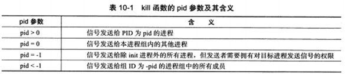
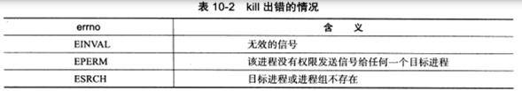
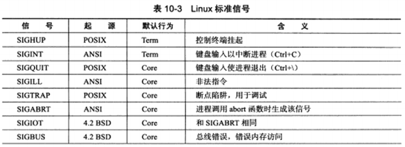
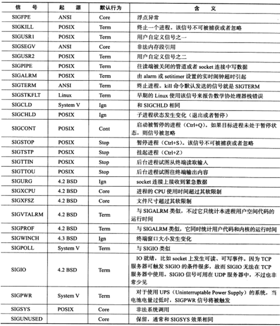

# linux 信号

* 简介

    * 信号是由用户，系统或者进程发送给目标进程的信息，以通知目标进程某个状态的改变或系统异常。Linux信号可由如下条件产生：
        
        1. 对于前台进程，用户可以通过输入特殊的终端字符来给它发送信号。比如输入Ctrl+C通常会给进程发送一个中断信号。
        2. 系统异常。比如浮点异常和非法内存段访问。
        3. 系统状态变化。比如alarm定时器将引起SIGALRM信号。  
        4. 运行kill命令或调用kill函数。
        服务器程序必须处理(或至少忽略)一些常见的信号，以免异常终止。

* 发送信号

```
#include<sys/types.h>
#include<signal.h>

/*给其他进程发送信号*/
int kill(pid_t pid, int sig);
```



Linux定义的信号值都大于0，如果sig取值为0，则kill函数不发送任何信号。但将sig设置为0可以用来检测目标进程或进程组是否存在，因为检测工作总是在信号发送之前就执行。不过这种检测方式是不可靠的。一方面由于进程PID的回绕，可能导致被检测的PID不是我们期望的进程的PID：另一方面，这种检测方法不是原子操作。



* 信号处理方式

```
typedef void (*__sighandler_t) (int);
```

信号处理函数只带有一个整型参数，该参数用来指示信号类型。信号处理函数应该是可重入的，否则很容易引发一些竞态条件。所以在信号处理函数中严禁调用一些不安全的函数。

```
#include <bits/signum.h>
#define SIG_DEL ((__sighandler_t) 0)
#define SIG_IGN ((__sighandler_t) 1)
```

SIG_IGN表示忽略目标信号， SIG_DEL表示使用信号的默认处理方式。信号的默认处理方式有如下几种：结束进程(Term),忽略信号（lgn），结束进程并生成核心转储文件(Core),暂停进程（stop），以及继续进程（Cont）






```
#include <signal.h>
/*设置处理函数*/
_sighandler_t signal (int sig, _sighandler_t _handler);
```

sig: 参数指出要捕获的信号类型。_handler参数是_sighandler_t类型的函数指针，用于指定信号sig的处理函数。

signal: 函数成功时返回一个函数指针，该函数指针的类型也是_sighandler_t.这个返回值是前一次调用signal函数时传入的函数指针，或者是信号sig对应的默认处理函数指针SIG_DEG（如果是第一次调用signal的话）。

signal系统调用出错时返回SIG_ERR,并设置errno。


```
#include <signal.h>
/*设置信号处理函数的更健壮的接口是如下的系统调用*/
int sigaction(int sig, const struct sigaction* act, struct sigaction* cact);
```

sig: 参数指出要捕获的信号类型。act参数指定新的信号处理方式，oact参数则输出信号先前的处理方式(如果不为NULL的话)。act和oact都是sigaction结构体类型的指针，sigaction结构体描述了信号处理的细节：

```
struct sigaction
{
#ifdef __USE_POSIX199309
    union
    {
        _sighandler_t sa_handler;
        void (*sa_sigaction) (int, siginfo_t*, void*);
    }
    _sigaction_handler;
    #define sa_handler __sigaction_handler.sa_handler
    #define sa_sigaction __sigaction_handler.sa_sigaction
    #else
        _sighandler_t sa_handler;
    #endif
        _sigset_t sa_mask;
        int sa_flags;
        void (*sa_restorer) (void);
};
```

sa_hander: 指定信号处理函数。

sa_mask: 设置进程的信号掩码(确切地说是在进程原有信号掩码的基础上增加信号掩码)，以指定哪些信号不能发送给本进程。sa_mask是信号集sigset_t(_sigset_t的同义词)类型，该类型指定一组信号。

sa_flags:


